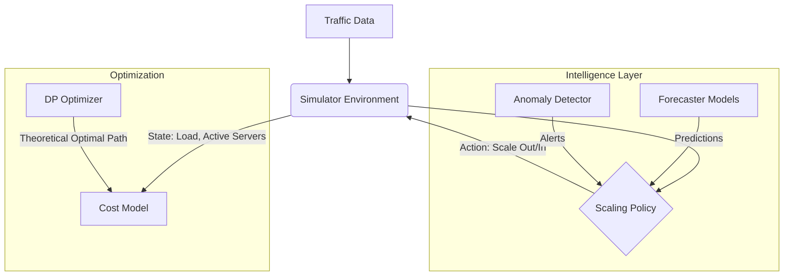

# DataFlow 2026: Intelligent Cloud Autoscaling & Forecasting

## Introduction
**DataFlow 2026** is a comprehensive framework for simulating, optimizing, and visualizing cloud autoscaling strategies powered by advanced time-series forecasting. The project addresses the critical challenge of balancing **System Performance** (minimizing dropped requests) against **Operational Cost** (server rental and scaling overhead).

By integrating machine learning models (Bi-LSTM, RVFL, SARIMAX) with a robust simulation environment and Dynamic Programming optimization, DataFlow 2026 provides a "North Star" for intelligent infrastructure management.

## Key Features
- **📊 Advanced Forecasting**: Multiple models including SARIMAX, Bi-LSTM (with Attention), and Random Vector Functional Link (RVFL) networks.
- **⚙️ Realistic Simulation**: Minute-by-minute simulation of cloud environments, accounting for server boot times (delays), cooldown periods, and capacity constraints.
- **🧠 Policy Engine**:
  - **Reactive**: Baseline scaling based on current load.
  - **Predictive**: Strategic scaling using forecast means.
  - **Hybrid**: Risk-averse scaling using Prediction Intervals and Anomaly Detection.
- **🎯 Global Optimization**: Theoretical optimal path calculation using Dynamic Programming (Backward Induction).
- **🖥️ Interactive Dashboards**: Streamlit-based interfaces for model evaluation and real-time simulation monitoring.

---

## Installation & Setup

### 1. Clone the Repository
```bash
git clone https://github.com/GinHikat/FomoKaguya2026.git
cd FomoKaguya2026
```

### 2. Install Dependencies
```bash
pip install -r requirement.txt
```

### 3. Environment Configuration
Copy the template and fill in your details (credentials for Google Sheets and local environment variables).
```bash
cp .env.example .env
```
*Note: `secret/ggsheet_credentials.json` and specific `.env` values are required for data ingestion from external sources.*

### 4. Data Preparation
Run the setup script to download and structure the dataset:
```bash
python set_up_dataset.py
```

---

## Usage Guide

### 🚀 Running the Dashboards

#### Forecasting Dashboard
Evaluate model performance and visualize predictions across different time intervals:
```bash
streamlit run app/Forecasting.py
```

#### Autoscaling Control Center
Simulate different scaling policies, watch real-time server booting, and perform sensitivity analysis:
```bash
streamlit run autoscaling/visualization/dashboard.py
```

### 🔧 Running Simulations (CLI)
To run a batch simulation and see comparative cost results:
```bash
python autoscaling/run_simulation.py
```

### 🛠️ Using the Processing Pipeline
Existing tutorial for manual log processing:

```python
import os
import sys

# Ensure root is in path
project_root = os.path.abspath(os.getcwd())
if project_root not in sys.path:
    sys.path.append(project_root)

from processing.ingestion_pipeline import Processor

processor = Processor()

# Example: Extract info from a single log line
log_line = '127.0.0.1 - - [10/Oct/2000:13:55:36 -0700] "GET /index.html HTTP/1.0" 200 2326'
info = processor.extract_info(log_line)
print(info)
```

## System Architecture


