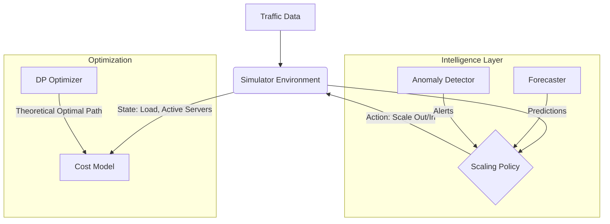

# Autoscaling Simulation & Optimization Module

## 1. Big Picture Purpose
The `autoscaling/` module is a **comprehensive simulation framework** designed to test, benchmark, and optimize cloud scaling strategies. It addresses the challenge of balancing **Performance** (zero dropped requests) vs. **Cost** (server rental + scale operations).

Unlike simple rule-based scalers, this system incorporates **Machine Learning** (Forecasting, Anomaly Detection) and **Dynamic Programming** to demonstrate how intelligent policies outperform traditional ones.

---

## 2. System Architecture

The system follows a classic **Agent-Environment** loop:

---

## 3. Mechanism by File

### A. Core Simulation Simulation
These files define the "World" and the "Rules".

#### `run_simulation.py`
- **Purpose**: The main entry point script (Orchestrator).
- **Mechanism**: 
    1. Loads traffic data (`load_data`) and Configuration (`config.yaml`).
    2. Generates Forecasts and Anomaly signals offline (batch mode).
    3. Runs the `DP Optimizer` to find the "North Star" best possible performance.
    4. Iterates through all policies (Reactive, Hybrid, etc.), running them through the `Simulator`.
    5. Prints a comparative cost summary.

#### `simulator.py`
- **Purpose**: Simulates the cloud environment state over time.
- **Mechanism**:
    - **State Tracking**: Keeps track of `active_servers` and `booting_servers` (a queue of servers waiting for startup time).
    - **Time Stepping**: In `run_scenario()`, it steps minute-by-minute.
    - **Constraint Enforcement**: Enforces `startup_time` (e.g., 3 mins delay) and `cooldown` periods.
    - **Load Balancing**: Distributes simulated traffic to active servers and counts `dropped_requests` if capacity is exceeded.

#### `cost_model.py`
- **Purpose**: The accountant. Calculates the financial impact of simulation results.
- **Mechanism**:
    - **Server Cost**: $ \text{Active Servers} \times \text{Cost per Minute} $.
    - **Scale Cost**: Penalizes frequent scaling operations (avoiding "flapping").
    - **Violation Cost**: Heaviest penalty. $ \text{Dropped Bytes} \times \text{SLA Penalty} $.

#### `config.yaml`
- **Purpose**: Central configuration file.
- **Mechanism**: Defines all constants like `max_servers`, `startup_time`, `capacity_per_server`, and cost weights. Changing this file recalibrates the entire simulation.

---

### B. Policy Engine (`policies.py`)
This file contains the "Auditioning Actors" - the strategies we are testing.

- **`ReactivePolicy`**:
    - **Mechanism**: The "Dummy" baseline. Scales only when *current* load exceeds thresholds. Laggy and prone to violations during spikes.
- **`PredictivePolicy`**:
    - **Mechanism**: Uses the Forecast *Mean* to scale in advance. Good for smooth traffic but risky if forecast under-predicts.
- **`HybridPolicy`**:
    - **Mechanism**: The "Smart" agent. 
        - Uses **Prediction Intervals** (Upper Bound) to be risk-averse (prevents under-scaling).
        - Listens to **Anomaly Detector** signals to trigger "Emergency Scale Out".
        - Uses **Hysteresis** (cooldowns) to prevent oscillation.

---

### C. Optimization Engine (`dp_optimizer.py`)
- **Purpose**: Finds the mathematical Global Optimum (The "God View").
- **Mechanism**:
    - Uses **Dynamic Programming (Backward Induction)**.
    - **State Space**: Models the system as `(ActiveServers, PendingQueue_1, PendingQueue_2)`. This accurately tracks the 3-minute boot delay.
    - **Solver**: Iterates backward from time $T$ to $0$, calculating the minimum cost-to-go for every possible state.
    - **Result**: Produces a trajectory that preemptively scales exactly $N$ minutes before a spike, proving the theoretical limit of efficiency.

---

### D. Intelligence Layer

#### `forecaster_integration.py`
- **Purpose**: Interface to the Deep Learning models.
- **Mechanism**: Loads the separate Bi-LSTM model (trained in Phase 2) and generates predictions for the simulation timeline.

#### `bonus/anomaly_detector.py`
- **Purpose**: Safety net for unexpected spikes (DDoS).
- **Mechanism**: 
    - Uses **Isolation Forest** (Unsupervised Learning).
    - Trains on historical load patterns.
    - `detect_batch()` returns a boolean array marking time steps as "Normal" or "Anomaly".

---

### E. Visualization (`visualization/`)
The interface for showing results to stakeholders.

#### `dashboard.py`
- **Purpose**: Interactive Web App (Streamlit).
- **Mechanism**:
    - **Live Simulation**: Animates the server booting process (visualizing the delay).
    - **Sensitivity Lab**: Allows "What-If" analysis (e.g., "What if startup time was 1 min instead of 3?").
    - **Comparison**: Displays Cost/Performance charts side-by-side.

#### `charts.py`
- **Purpose**: Plotting logic (Plotly & Matplotlib).
- **Mechanism**: Specialized functions to plot the "Timeline" (Load vs. Active Servers) and "Cost Breakdown" (Stacked Bar Chart). Includes logic to shade Prediction Confidence Intervals and mark Anomalies.
