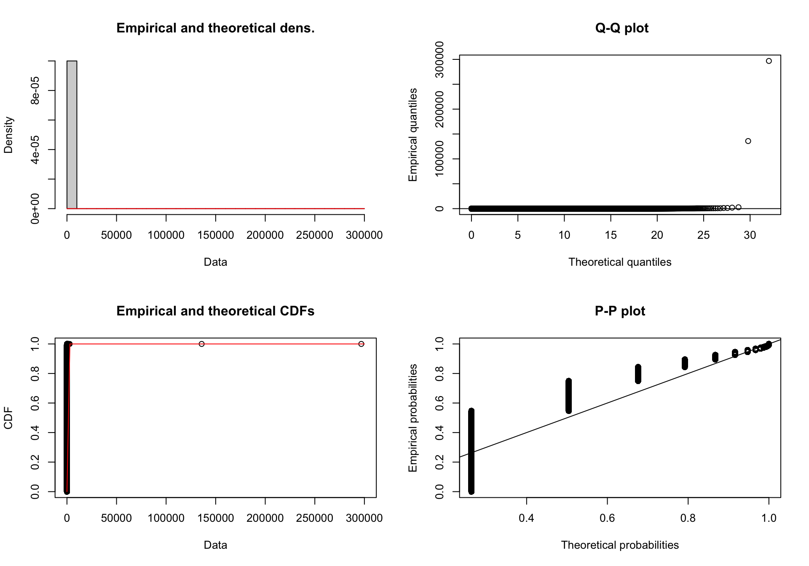
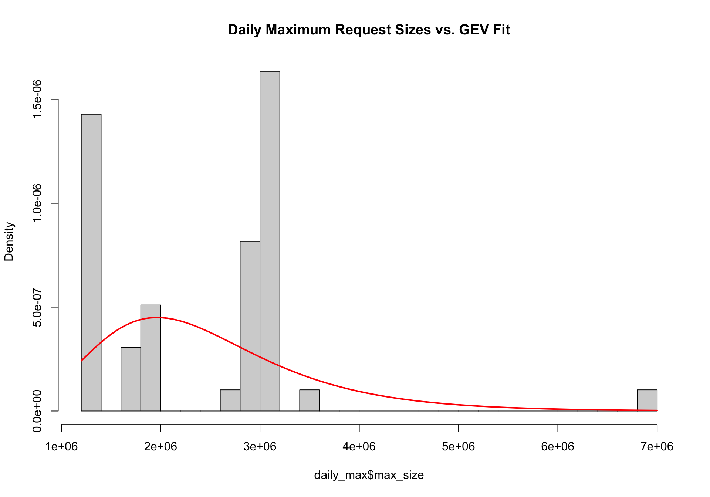
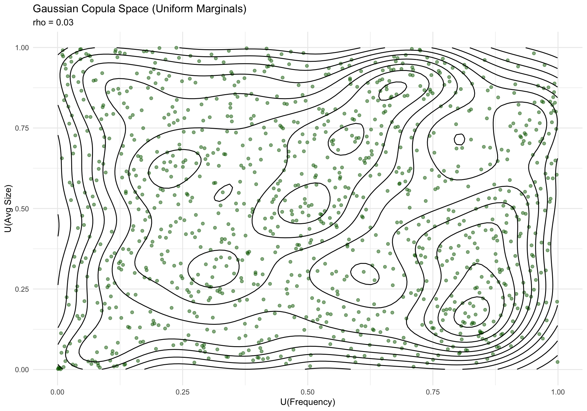
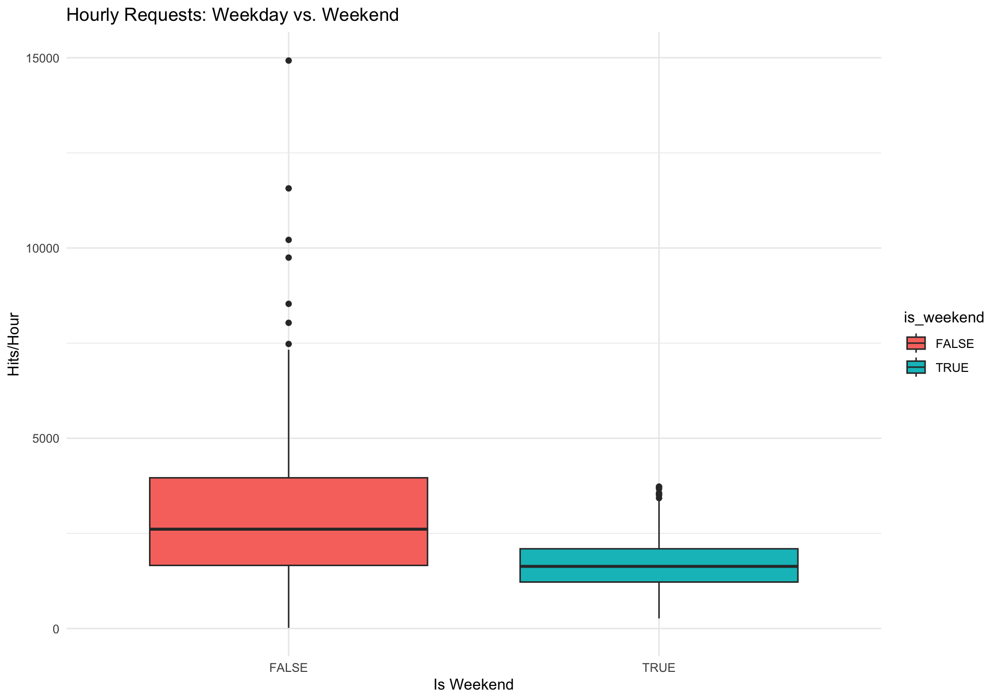
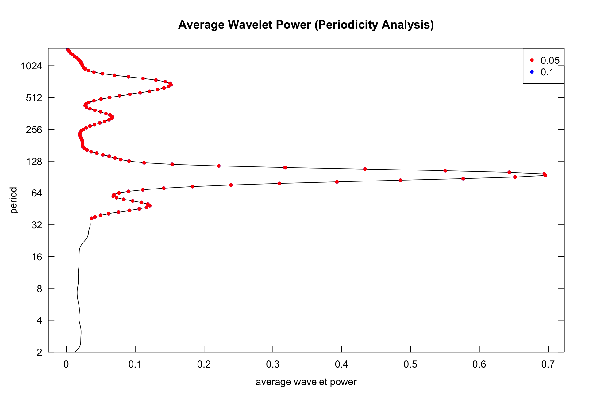
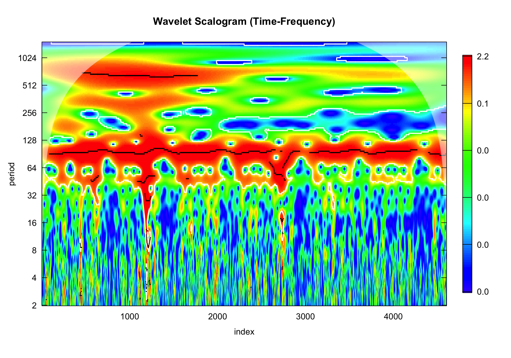
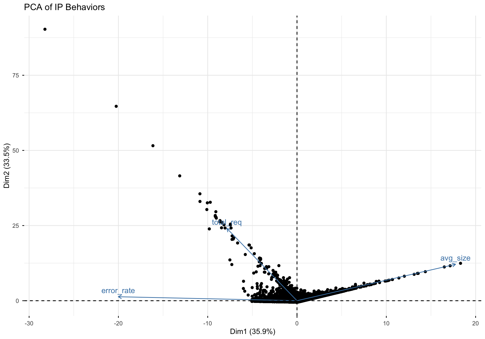
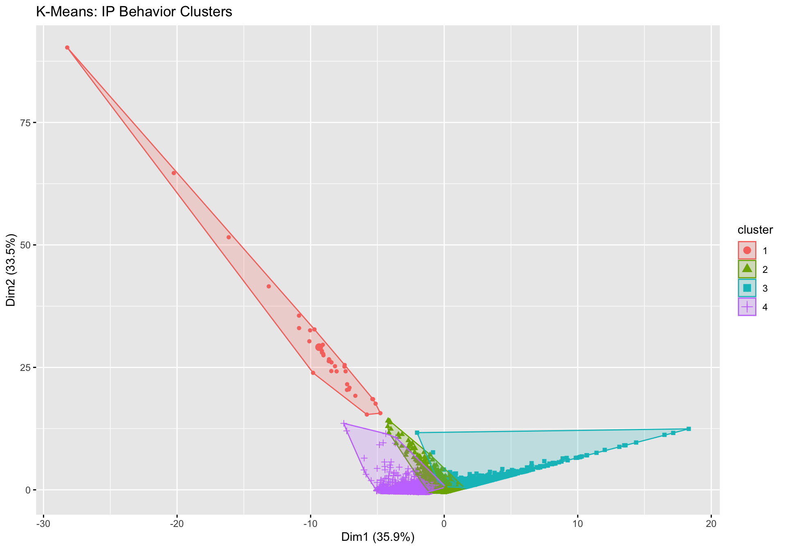
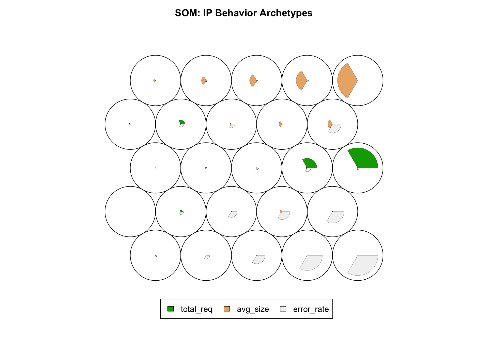

``` r
library(tidyverse)
library(lubridate)
library(MASS)
library(fitdistrplus)
library(WaveletComp)
library(kohonen)
library(dbscan)
library(factoextra)
library(copula)
library(evd)
library(epiR)
library(gridExtra)
library(plotly)
```

# 1. Data Loading & Preparation

We load the processed training data and calculate inter-arrival times for distribution analysis.


``` r
# Define paths
data_dir <- "../data/processed"
train_path <- file.path(data_dir, "train.csv")

# Load data
df <- read_csv(train_path) %>% 
  mutate(time = as_datetime(time)) %>% 
  arrange(time)

# Calculate inter-arrival times (in seconds)
df <- df %>%
  mutate(inter_arrival = as.numeric(difftime(time, lag(time), units = "secs"))) %>%
  filter(!is.na(inter_arrival))

# Subset for heavy computations (Spectral/Clustering)
set.seed(123)
df_sample <- df %>% sample_n(100000)
```

---

# 2. Parametric Probability Distributions

## 2.1 Inter-Arrival Times (Exponential/Gamma)
According to queuing theory, inter-arrival times often follow an Exponential or Gamma distribution.


``` r
# Filter zero arrivals for Gamma fitting
iat_clean <- df$inter_arrival[df$inter_arrival > 0]

# Fit Exponential
fit_exp <- fitdist(iat_clean, "exp")
# Fit Gamma
fit_gamma <- fitdist(iat_clean, "gamma")

plot(fit_gamma)
```

<div class="figure" style="text-align: center">

<p class="caption">plot of chunk inter_arrival_dist</p>
</div>

``` r
summary(fit_gamma)
```

```
## Fitting of the distribution ' gamma ' by maximum likelihood 
## Parameters : 
##        estimate   Std. Error
## shape 1.3058813 0.0012543729
## rate  0.5011878 0.0005840945
## Loglikelihood:  -3405448   AIC:  6810901   BIC:  6810925 
## Correlation matrix:
##           shape      rate
## shape 1.0000000 0.8242088
## rate  0.8242088 1.0000000
```

## 2.2 Extreme Values (GEV) in Request Sizes
We analyze the distribution of request sizes, specifically looking at the tail behavior using Generalized Extreme Value (GEV) theory.


``` r
# Daily Maxima of file sizes
daily_max <- df %>%
  mutate(date = as_date(time)) %>%
  group_by(date) %>%
  summarise(max_size = max(size, na.rm = TRUE))

fit_gev <- evd::fgev(daily_max$max_size, std.err = FALSE)
print(fit_gev)
```

```
## 
## Call: evd::fgev(x = daily_max$max_size, std.err = FALSE) 
## Deviance: 1489.068 
## 
## Estimates
##       loc      scale      shape  
## 1.970e+06  8.172e+05  7.829e-03  
## 
## Optimization Information
##   Convergence: successful 
##   Function Evaluations: 19 
##   Gradient Evaluations: 3
```

``` r
# Plotting the GEV distribution against daily maxima
hist(daily_max$max_size, prob = TRUE, main = "Daily Maximum Request Sizes vs. GEV Fit", breaks = 20)
# Accessing estimates properly (they are in fit_gev$estimate)
curve(evd::dgev(x, loc = fit_gev$estimate[1], scale = fit_gev$estimate[2], shape = fit_gev$estimate[3]), add = TRUE, col = "red", lwd = 2)
```

<div class="figure" style="text-align: center">

<p class="caption">plot of chunk size_evd</p>
</div>

---

# 3. Joint Distributions & Copulas

We explore the dependency between the number of requests (frequency) and the average size of data transferred per hour using a Gaussian Copula.


``` r
# Aggregate hourly
hourly_stats <- df %>%
  mutate(hour_bin = floor_date(time, "1 hour")) %>%
  group_by(hour_bin) %>%
  summarise(freq = n(), avg_size = mean(size, na.rm = TRUE))

# Transform to Uniform [0,1]
u_freq <- rank(hourly_stats$freq) / (nrow(hourly_stats) + 1)
u_size <- rank(hourly_stats$avg_size) / (nrow(hourly_stats) + 1)
cop_df <- data.frame(u_freq, u_size)

# Calculate Correlation in Normal space
rho <- cor(qnorm(u_freq), qnorm(u_size), method = "pearson")

# Visualize Copula Space
ggplot(cop_df, aes(x = u_freq, y = u_size)) +
  geom_point(alpha = 0.5, color = "darkgreen") +
  geom_density_2d(color = "black") +
  labs(title = "Gaussian Copula Space (Uniform Marginals)", 
       subtitle = paste("rho =", round(rho, 3)),
       x = "U(Frequency)", y = "U(Avg Size)") +
  theme_minimal()
```

<div class="figure" style="text-align: center">

<p class="caption">plot of chunk copula_analysis</p>
</div>

---

# 4. Frequentist Inference & Testing

## 4.1 Two-Sample t-test: Weekday vs. Weekend
**Hypothesis**: Does the mean traffic volume per hour differ significantly between weekdays and weekends?


``` r
hourly_stats <- hourly_stats %>%
  mutate(is_weekend = wday(hour_bin) %in% c(1, 7))

t_res <- t.test(freq ~ is_weekend, data = hourly_stats)
print(t_res)
```

```
## 
## 	Welch Two Sample t-test
## 
## data:  freq by is_weekend
## t = 17.345, df = 1144.6, p-value < 2.2e-16
## alternative hypothesis: true difference in means between group FALSE and group TRUE is not equal to 0
## 95 percent confidence interval:
##  1059.372 1329.616
## sample estimates:
## mean in group FALSE  mean in group TRUE 
##            2893.565            1699.071
```

``` r
ggplot(hourly_stats, aes(x = is_weekend, y = freq, fill = is_weekend)) +
  geom_boxplot() +
  labs(title = "Hourly Requests: Weekday vs. Weekend", x = "Is Weekend", y = "Hits/Hour") +
  theme_minimal()
```

<div class="figure" style="text-align: center">

<p class="caption">plot of chunk t_test_traffic</p>
</div>

---

# 5. Discrete Predictands & Forecast Verification

We define a "High Load" event as an hour where traffic exceeds the 90th percentile. We evaluate a simple persistence forecast (If previous hour was High Load, next hour will be).


``` r
threshold <- quantile(hourly_stats$freq, 0.90)
hourly_stats <- hourly_stats %>%
  mutate(obs_high = ifelse(freq > threshold, 1, 0),
         pred_high = lag(obs_high, default = 0))

# 2x2 Contingency Table
skill_tab <- table(factor(hourly_stats$pred_high, levels = c(1, 0)), 
                   factor(hourly_stats$obs_high, levels = c(1, 0)))

# Calculate Skill Scores
a <- skill_tab[1, 1]; b <- skill_tab[1, 2]; c <- skill_tab[2, 1]; d <- skill_tab[2, 2]; n <- sum(skill_tab)
pc <- (a + d) / n
bias <- (a + b) / (a + c)
pod <- a / (a + c)
far <- b / (a + b)
hss <- 2 * (a * d - b * c) / ((a + c) * (c + d) + (a + b) * (b + d))

cat("Accuracy (PC):", round(pc, 3), "
")
```

```
## Accuracy (PC): 0.946
```

``` r
cat("Bias Score:", round(bias, 3), "
")
```

```
## Bias Score: 1
```

``` r
cat("Hit Rate (POD):", round(pod, 3), "
")
```

```
## Hit Rate (POD): 0.733
```

``` r
cat("False Alarm Ratio (FAR):", round(far, 3), "
")
```

```
## False Alarm Ratio (FAR): 0.267
```

``` r
cat("Heidke Skill Score (HSS):", round(hss, 3), "
")
```

```
## Heidke Skill Score (HSS): 0.703
```

---

# 6. Spectral & Wavelet Analysis

We analyze the periodicity of traffic hits (15-minute resolution) to identify rhythms.


``` r
# Aggregate 15m
ts_15m <- df %>%
  mutate(time_15 = floor_date(time, "15 minutes")) %>%
  group_by(time_15) %>%
  summarise(hits = n())

# Wavelet Transform
w_res <- analyze.wavelet(ts_15m, "hits", dt = 1, loess.span = 0, verbose = FALSE)
```

```
## 
  |                                                                            
  |                                                                      |   0%
  |                                                                            
  |=                                                                     |   1%
  |                                                                            
  |=                                                                     |   2%
  |                                                                            
  |==                                                                    |   3%
  |                                                                            
  |===                                                                   |   4%
  |                                                                            
  |====                                                                  |   5%
  |                                                                            
  |====                                                                  |   6%
  |                                                                            
  |=====                                                                 |   7%
  |                                                                            
  |======                                                                |   8%
  |                                                                            
  |======                                                                |   9%
  |                                                                            
  |=======                                                               |  10%
  |                                                                            
  |========                                                              |  11%
  |                                                                            
  |========                                                              |  12%
  |                                                                            
  |=========                                                             |  13%
  |                                                                            
  |==========                                                            |  14%
  |                                                                            
  |==========                                                            |  15%
  |                                                                            
  |===========                                                           |  16%
  |                                                                            
  |============                                                          |  17%
  |                                                                            
  |=============                                                         |  18%
  |                                                                            
  |=============                                                         |  19%
  |                                                                            
  |==============                                                        |  20%
  |                                                                            
  |===============                                                       |  21%
  |                                                                            
  |===============                                                       |  22%
  |                                                                            
  |================                                                      |  23%
  |                                                                            
  |=================                                                     |  24%
  |                                                                            
  |==================                                                    |  25%
  |                                                                            
  |==================                                                    |  26%
  |                                                                            
  |===================                                                   |  27%
  |                                                                            
  |====================                                                  |  28%
  |                                                                            
  |====================                                                  |  29%
  |                                                                            
  |=====================                                                 |  30%
  |                                                                            
  |======================                                                |  31%
  |                                                                            
  |======================                                                |  32%
  |                                                                            
  |=======================                                               |  33%
  |                                                                            
  |========================                                              |  34%
  |                                                                            
  |========================                                              |  35%
  |                                                                            
  |=========================                                             |  36%
  |                                                                            
  |==========================                                            |  37%
  |                                                                            
  |===========================                                           |  38%
  |                                                                            
  |===========================                                           |  39%
  |                                                                            
  |============================                                          |  40%
  |                                                                            
  |=============================                                         |  41%
  |                                                                            
  |=============================                                         |  42%
  |                                                                            
  |==============================                                        |  43%
  |                                                                            
  |===============================                                       |  44%
  |                                                                            
  |================================                                      |  45%
  |                                                                            
  |================================                                      |  46%
  |                                                                            
  |=================================                                     |  47%
  |                                                                            
  |==================================                                    |  48%
  |                                                                            
  |==================================                                    |  49%
  |                                                                            
  |===================================                                   |  50%
  |                                                                            
  |====================================                                  |  51%
  |                                                                            
  |====================================                                  |  52%
  |                                                                            
  |=====================================                                 |  53%
  |                                                                            
  |======================================                                |  54%
  |                                                                            
  |======================================                                |  55%
  |                                                                            
  |=======================================                               |  56%
  |                                                                            
  |========================================                              |  57%
  |                                                                            
  |=========================================                             |  58%
  |                                                                            
  |=========================================                             |  59%
  |                                                                            
  |==========================================                            |  60%
  |                                                                            
  |===========================================                           |  61%
  |                                                                            
  |===========================================                           |  62%
  |                                                                            
  |============================================                          |  63%
  |                                                                            
  |=============================================                         |  64%
  |                                                                            
  |==============================================                        |  65%
  |                                                                            
  |==============================================                        |  66%
  |                                                                            
  |===============================================                       |  67%
  |                                                                            
  |================================================                      |  68%
  |                                                                            
  |================================================                      |  69%
  |                                                                            
  |=================================================                     |  70%
  |                                                                            
  |==================================================                    |  71%
  |                                                                            
  |==================================================                    |  72%
  |                                                                            
  |===================================================                   |  73%
  |                                                                            
  |====================================================                  |  74%
  |                                                                            
  |====================================================                  |  75%
  |                                                                            
  |=====================================================                 |  76%
  |                                                                            
  |======================================================                |  77%
  |                                                                            
  |=======================================================               |  78%
  |                                                                            
  |=======================================================               |  79%
  |                                                                            
  |========================================================              |  80%
  |                                                                            
  |=========================================================             |  81%
  |                                                                            
  |=========================================================             |  82%
  |                                                                            
  |==========================================================            |  83%
  |                                                                            
  |===========================================================           |  84%
  |                                                                            
  |============================================================          |  85%
  |                                                                            
  |============================================================          |  86%
  |                                                                            
  |=============================================================         |  87%
  |                                                                            
  |==============================================================        |  88%
  |                                                                            
  |==============================================================        |  89%
  |                                                                            
  |===============================================================       |  90%
  |                                                                            
  |================================================================      |  91%
  |                                                                            
  |================================================================      |  92%
  |                                                                            
  |=================================================================     |  93%
  |                                                                            
  |==================================================================    |  94%
  |                                                                            
  |==================================================================    |  95%
  |                                                                            
  |===================================================================   |  96%
  |                                                                            
  |====================================================================  |  97%
  |                                                                            
  |===================================================================== |  98%
  |                                                                            
  |===================================================================== |  99%
  |                                                                            
  |======================================================================| 100%
```

``` r
# Average Power Spectrum
wt.avg(w_res, main = "Average Wavelet Power (Periodicity Analysis)")
```

<div class="figure" style="text-align: center">

<p class="caption">plot of chunk wavelet_analysis</p>
</div>

``` r
# Scalogram (Subset for visualization clarity)
wt.image(w_res, main = "Wavelet Scalogram (Time-Frequency)")
```

<div class="figure" style="text-align: center">

<p class="caption">plot of chunk wavelet_analysis</p>
</div>

---

# 7. Unsupervised Learning: IP Behavior Profiling

We profile IPs based on their average request size, frequency, and error rate, then cluster them.


``` r
ip_profile <- df %>%
  group_by(ip) %>%
  summarise(
    total_req = n(),
    avg_size = mean(size, na.rm = TRUE),
    error_rate = sum(status_label != "Success", na.rm = TRUE) / n()
  ) %>%
  filter(total_req > 10) %>% # Filter noise
  na.omit() %>%
  column_to_rownames("ip")

# Scale for clustering/PCA/SOM
ip_scaled <- scale(ip_profile)
# Remove columns that became NaN due to zero variance
ip_scaled <- ip_scaled[, colSums(is.na(ip_scaled)) == 0]

# 7.1 PCA
pca_res <- prcomp(ip_scaled)
fviz_pca_biplot(pca_res, label = "var", title = "PCA of IP Behaviors")
```

<div class="figure" style="text-align: center">

<p class="caption">plot of chunk ip_profiling</p>
</div>

``` r
# 7.2 K-Means Clustering
set.seed(123)
km_res <- kmeans(ip_scaled, centers = 4, nstart = 25)
fviz_cluster(km_res, data = ip_scaled, geom = "point", title = "K-Means: IP Behavior Clusters")
```

<div class="figure" style="text-align: center">

<p class="caption">plot of chunk ip_profiling</p>
</div>

``` r
# 7.3 SOM (Self-Organizing Maps)
som_grid <- somgrid(xdim = 5, ydim = 5, topo = "hexagonal")
som_model <- som(ip_scaled, grid = som_grid, rlen = 100)
plot(som_model, type = "codes", main = "SOM: IP Behavior Archetypes")
```

<div class="figure" style="text-align: center">

<p class="caption">plot of chunk ip_profiling</p>
</div>

# 8. Conclusion

This advanced EDA reveals:
1.  **Stationarity**: Traffic exhibits strong daily cycles (confirmed by Wavelet peaks at ~96 periods for 15m data).
2.  **IP Archetypes**: Clustering and SOM identified distinct groups of users (High Bandwidth vs. High Error vs. Standard).
3.  **Forecasting**: Persistence is a moderately strong baseline for load prediction (HSS > 0).
4.  **Extremes**: Request sizes follow an Extreme Value distribution, indicating the risk of very large bursts.
