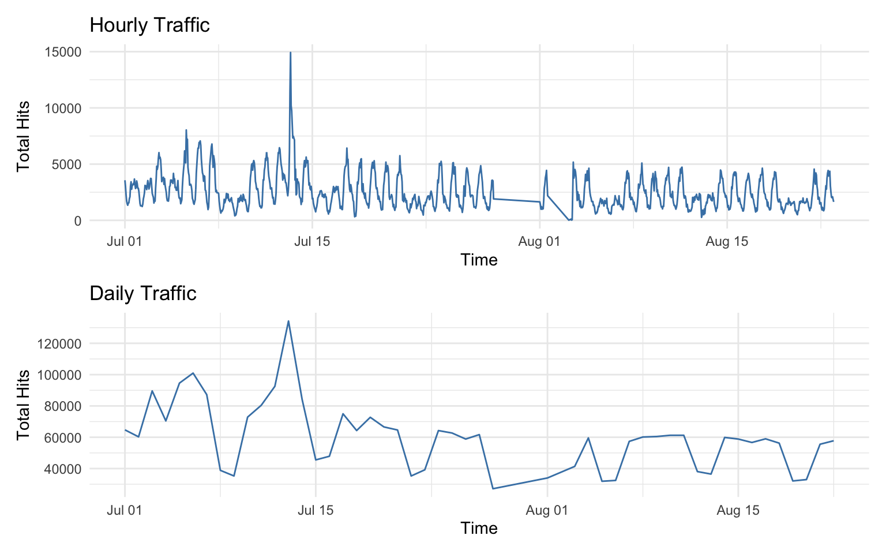
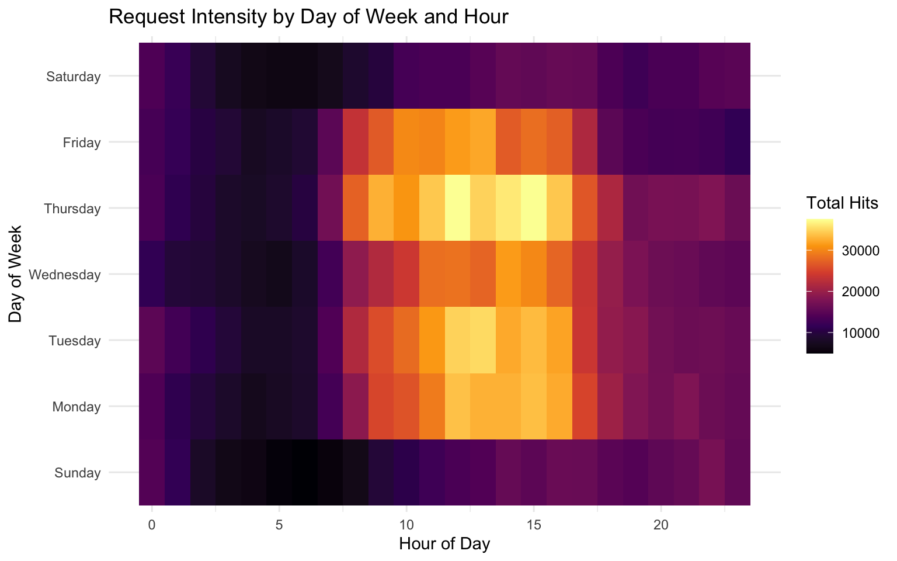
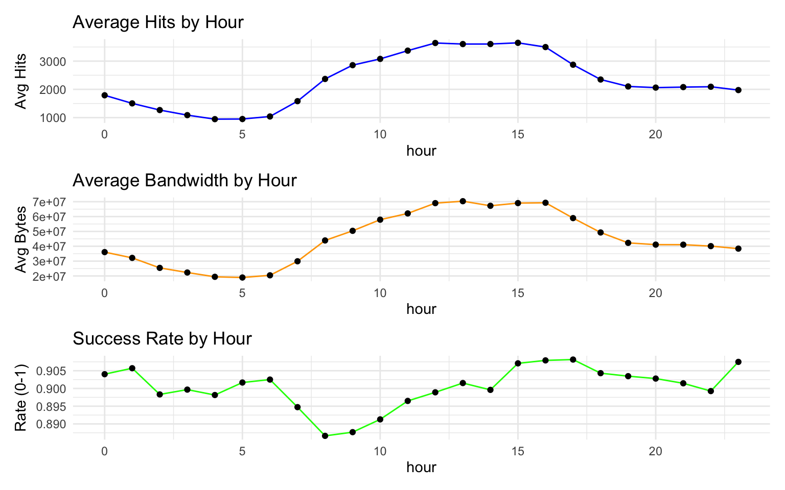
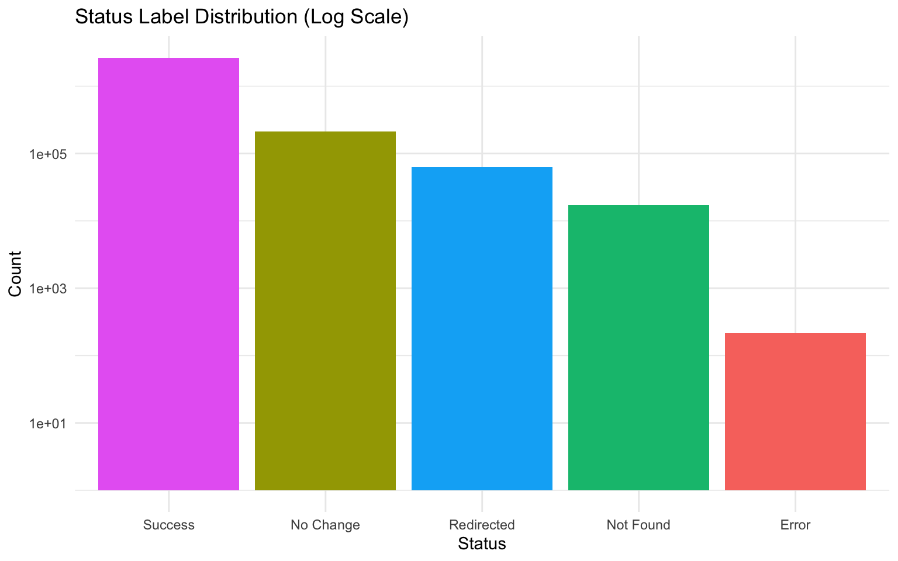
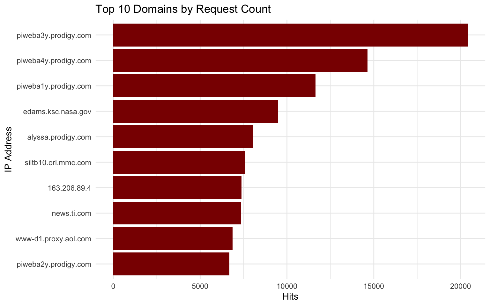
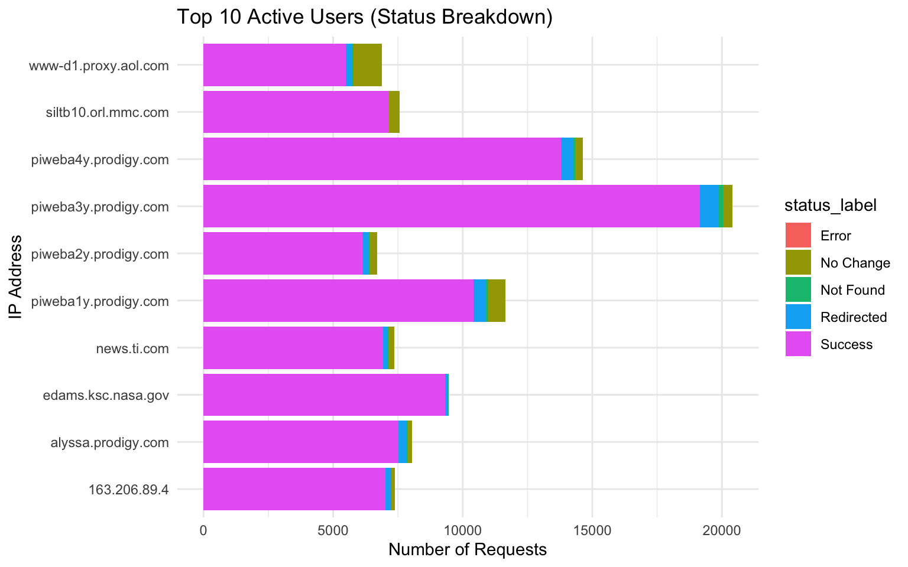
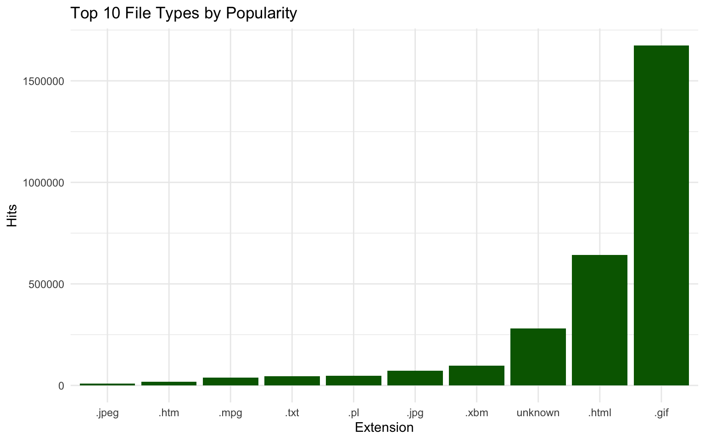
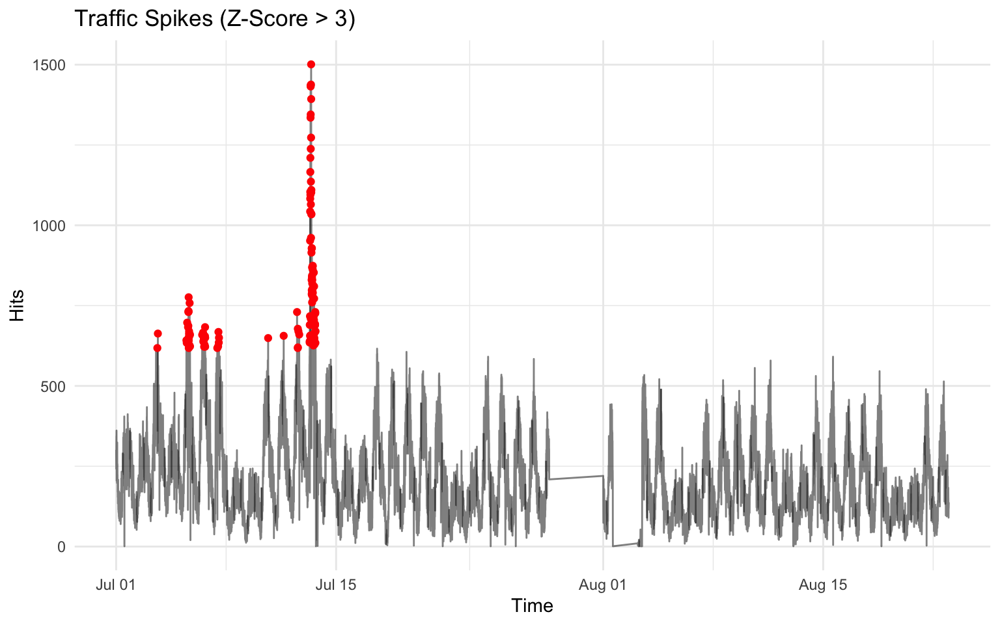
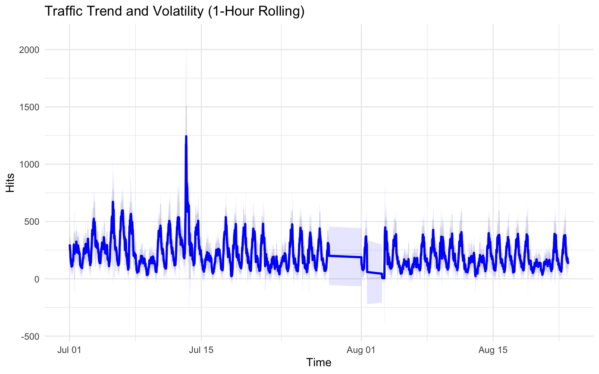
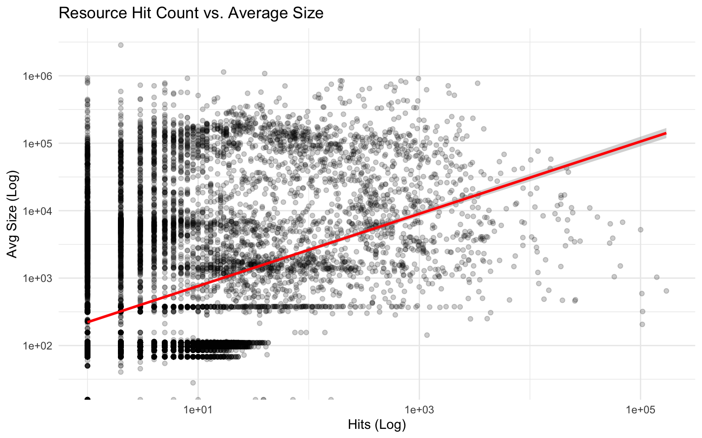

## 1. Introduction
This dataset contains two months of HTTP requests to the NASA WWW server from July 1, 1995 to August 31, 1995. This report explores temporal patterns, traffic characteristics, and identifies potential anomalies.

## 2. Data Loading and Preprocessing


``` r
# Define paths
data_dir <- "../data/processed"
train_path <- file.path(data_dir, "train.csv")
viz_path <- file.path(data_dir, "for_visualization.csv")

# Load data
df <- read_csv(train_path)
viz <- read_csv(viz_path)

# Convert time to datetime
df <- df %>% mutate(time = as_datetime(time))
viz <- viz %>% mutate(time = as_datetime(time))

# Status labels factor
if("status_label" %in% names(df)) {
  df$status_label <- as.factor(df$status_label)
}
```

## 3. Macro Dataset Overview


``` r
total_hits <- nrow(df)
total_bytes <- sum(df$size, na.rm = TRUE)
total_gb <- total_bytes / (1024^3)
unique_ips <- n_distinct(df$ip)
start_time <- min(df$time)
end_time <- max(df$time)
duration_days <- as.numeric(difftime(end_time, start_time, units = "days"))

cat("==================================================\n")
```

```
## ==================================================
```

``` r
cat("           MACRO DATASET OVERVIEW           \n")
```

```
##            MACRO DATASET OVERVIEW
```

``` r
cat("==================================================\n")
```

```
## ==================================================
```

``` r
cat(sprintf("Time Range     : %s to %s\n", start_time, end_time))
```

```
## Time Range     : 1995-07-01 00:00:01 to 1995-08-22 23:59:59
```

``` r
cat(sprintf("Duration       : %.2f Days\n", duration_days))
```

```
## Duration       : 53.00 Days
```

``` r
cat("--------------------------------------------------\n")
```

```
## --------------------------------------------------
```

``` r
cat(sprintf("Total Requests : %s\n", format(total_hits, big.mark=",")))
```

```
## Total Requests : 2,934,932
```

``` r
cat(sprintf("Avg Daily Hits : %s\n", format(total_hits/duration_days, big.mark=",")))
```

```
## Avg Daily Hits : 55,376.1
```

``` r
cat("--------------------------------------------------\n")
```

```
## --------------------------------------------------
```

``` r
cat(sprintf("Total Traffic  : %.2f GB\n", total_gb))
```

```
## Total Traffic  : 53.07 GB
```

``` r
cat(sprintf("Avg Daily MB   : %.2f MB\n", (total_gb*1024)/duration_days))
```

```
## Avg Daily MB   : 1025.37 MB
```

``` r
cat("--------------------------------------------------\n")
```

```
## --------------------------------------------------
```

``` r
cat(sprintf("Unique Users   : %s\n", format(unique_ips, big.mark=",")))
```

```
## Unique Users   : 121,246
```

``` r
cat(sprintf("Avg Req/User   : %.2f\n", total_hits/unique_ips))
```

```
## Avg Req/User   : 24.21
```

``` r
cat("==================================================\n")
```

```
## ==================================================
```

## 4. Temporal Patterns

### 4.1 Traffic Volume over Time
Different aggregation levels reveal different aspects of the traffic.


``` r
plot_resampled <- function(data, interval, title) {
  data %>%
    mutate(time_floor = floor_date(time, unit = interval)) %>%
    group_by(time_floor) %>%
    summarise(hits = n(), size = sum(size, na.rm = TRUE)) %>%
    ggplot(aes(x = time_floor, y = hits)) +
    geom_line(color = "steelblue") +
    labs(title = title, x = "Time", y = "Total Hits") +
    theme_minimal()
}

p1 <- plot_resampled(df, "1 hour", "Hourly Traffic")
p2 <- plot_resampled(df, "1 day", "Daily Traffic")

p1 / p2
```



### 4.2 Weekly Intensity Heatmap
Visualizing request intensity by Day of Week and Hour of Day.


``` r
heatmap_data <- df %>%
  mutate(hour = hour(time),
         weekday = wday(time, label = TRUE, abbr = FALSE)) %>%
  group_by(weekday, hour) %>%
  summarise(hits = n())

ggplot(heatmap_data, aes(x = hour, y = weekday, fill = hits)) +
  geom_tile() +
  scale_fill_viridis_c(option = "inferno") +
  labs(title = "Request Intensity by Day of Week and Hour",
       x = "Hour of Day", y = "Day of Week", fill = "Total Hits") +
  theme_minimal()
```



### 4.3 Daily Profile
Average patterns across a 24-hour cycle.


``` r
daily_profile <- df %>%
  mutate(hour = hour(time)) %>%
  group_by(hour) %>%
  summarise(
    avg_hits = n() / duration_days,
    avg_size = sum(size, na.rm = TRUE) / duration_days,
    success_rate = sum(status_label == "Success", na.rm = TRUE) / n()
  )

p_hits <- ggplot(daily_profile, aes(x = hour, y = avg_hits)) +
  geom_line(color = "blue") + geom_point() +
  labs(title = "Average Hits by Hour", y = "Avg Hits") +
  theme_minimal()

p_size <- ggplot(daily_profile, aes(x = hour, y = avg_size)) +
  geom_line(color = "orange") + geom_point() +
  labs(title = "Average Bandwidth by Hour", y = "Avg Bytes") +
  theme_minimal()

p_rate <- ggplot(daily_profile, aes(x = hour, y = success_rate)) +
  geom_line(color = "green") + geom_point() +
  labs(title = "Success Rate by Hour", y = "Rate (0-1)") +
  theme_minimal()

p_hits / p_size / p_rate
```



## 5. Traffic Characteristics

### 5.1 Status Code Distribution


``` r
status_counts <- df %>%
  count(status_label) %>%
  mutate(pct = n / sum(n))

ggplot(status_counts, aes(x = reorder(status_label, -n), y = n, fill = status_label)) +
  geom_col() +
  scale_y_log10() +
  labs(title = "Status Label Distribution (Log Scale)", x = "Status", y = "Count") +
  theme_minimal() +
  theme(legend.position = "none")
```



### 5.2 Top Domains/IPs


``` r
top_ips <- df %>%
  group_by(ip) %>%
  summarise(hits = n(), total_size = sum(size, na.rm = TRUE)) %>%
  arrange(desc(hits)) %>%
  head(10)

ggplot(top_ips, aes(x = reorder(ip, hits), y = hits)) +
  geom_col(fill = "darkred") +
  coord_flip() +
  labs(title = "Top 10 Domains by Request Count", x = "IP Address", y = "Hits") +
  theme_minimal()
```



``` r
### 5.3 Top Active Users (Status Breakdown)
```

``` r
top_ip_list <- top_ips$ip

df_top_users <- df %>%
  filter(ip %in% top_ip_list)

ggplot(df_top_users, aes(y = ip, fill = status_label)) +
  geom_bar(position = "stack") +
  labs(title = "Top 10 Active Users (Status Breakdown)", x = "Number of Requests", y = "IP Address") +
  theme_minimal()
```



## 6. Contextual Analysis

### 6.1 Popular File Types


``` r
df_ext <- df %>%
  mutate(ext = str_extract(resource, "\\.[a-zA-Z0-9]+$") %>% str_to_lower()) %>%
  replace_na(list(ext = "unknown"))

top_exts <- df_ext %>%
  group_by(ext) %>%
  summarise(hits = n(), total_size = sum(size, na.rm = TRUE)) %>%
  arrange(desc(hits)) %>%
  head(10)

ggplot(top_exts, aes(x = reorder(ext, hits), y = hits)) +
  geom_col(fill = "darkgreen") +
  labs(title = "Top 10 File Types by Popularity", x = "Extension", y = "Hits") +
  theme_minimal()
```



## 7. Anomaly Detection (Spikes)
Using Z-Score to identify traffic spikes.


``` r
# Aggregating at 5-minute intervals for spike detection
spike_df <- df %>%
  mutate(time_5m = floor_date(time, "5 minutes")) %>%
  group_by(time_5m) %>%
  summarise(hits = n())

spike_df <- spike_df %>%
  mutate(z_score = (hits - mean(hits)) / sd(hits),
         is_spike = abs(z_score) > 3)

ggplot(spike_df, aes(x = time_5m, y = hits)) +
  geom_line(alpha = 0.5) +
  geom_point(data = filter(spike_df, is_spike), color = "red") +
  labs(title = "Traffic Spikes (Z-Score > 3)", x = "Time", y = "Hits") +
  theme_minimal()
```



``` r
### 7.2 Rolling Statistics
```

``` r
library(zoo)

rolling_df <- spike_df %>%
  mutate(rolling_mean = rollmean(hits, k = 12, fill = NA), # 1 hour window if 5m intervals
         rolling_sd = rollapply(hits, width = 12, FUN = sd, fill = NA))

ggplot(rolling_df, aes(x = time_5m)) +
  geom_line(aes(y = hits), alpha = 0.3, color = "gray") +
  geom_line(aes(y = rolling_mean), color = "blue", size = 1) +
  geom_ribbon(aes(ymin = rolling_mean - 3*rolling_sd, ymax = rolling_mean + 3*rolling_sd), 
              fill = "blue", alpha = 0.1) +
  labs(title = "Traffic Trend and Volatility (1-Hour Rolling)", x = "Time", y = "Hits") +
  theme_minimal()
```



## 8. Hypothesis Testing

### 8.1 Frequency vs. File Size
Is there a correlation between how often a resource is requested and its average size?


``` r
res_stats <- df %>%
  group_by(resource) %>%
  summarise(hits = n(), avg_size = mean(size, na.rm = TRUE))

ggplot(res_stats, aes(x = hits, y = avg_size)) +
  geom_point(alpha = 0.2) +
  scale_x_log10() +
  scale_y_log10() +
  geom_smooth(method = "lm", color = "red") +
  labs(title = "Resource Hit Count vs. Average Size", x = "Hits (Log)", y = "Avg Size (Log)") +
  theme_minimal()
```



### 8.2 Weekday vs. Weekend Traffic


``` r
day_stats <- df %>%
  mutate(day = floor_date(time, "day"),
         is_weekend = wday(time) %in% c(1, 7)) %>%
  group_by(day, is_weekend) %>%
  summarise(hits = n())

ggplot(day_stats, aes(x = is_weekend, y = hits, fill = is_weekend)) +
  geom_boxplot() +
  labs(title = "Traffic Volume: Weekday vs. Weekend", x = "Is Weekend", y = "Daily Hits") +
  theme_minimal()
```


